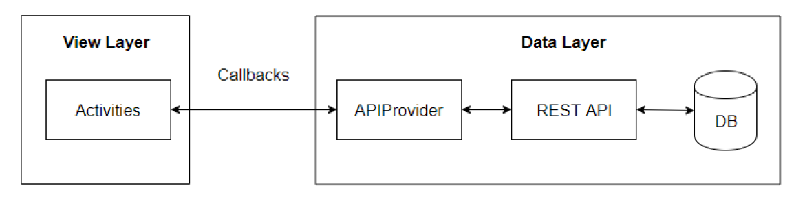

# Notes Manager
### Description
The project is a mobile application, which manages the notes of different users. It supports the following actions: register, login, logout, creating, deleting and editing notes.
Every note object consists of title and body and is kept in database on the server. The mobile app accesses this content using the REST API on the server which is written in PHP.
The application also persists the login information using shared preferences.

### Implementation
The mobile application is writtein in Java 8 and the back-end part in PHP. MariaDB is used for database and for saving the login information SharedPreferences. 
When the user starts the application first it is checked whether there is data in the SharedPrefereces for logged in user. If there is, then all notes of the current
user are being shown and allows to create/edit/delete a note. If there isn't a logged in user, then the user gets redirected to the login activity, where ther user can login or 
go to the register activity and register. When successful login or registration occurs the user is logged in, loads all notes and saves the information in the SharedPreferences.

### High-level architecture

